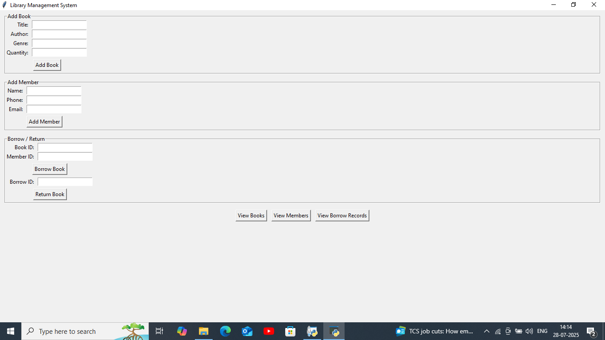
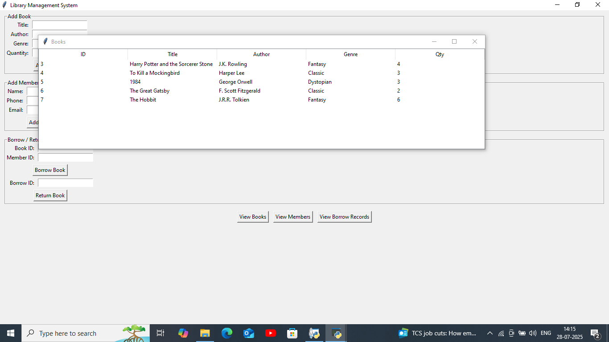
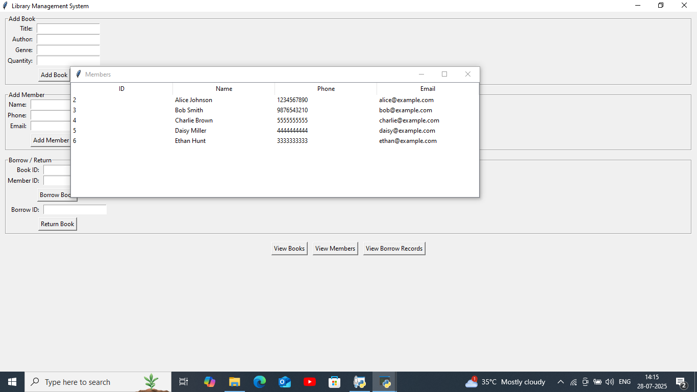
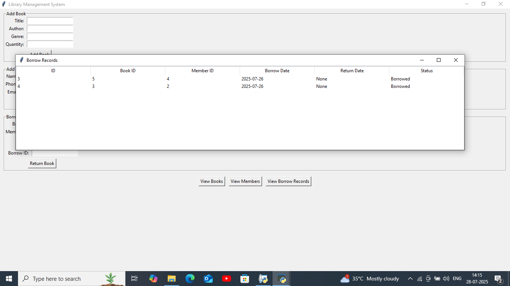

# 📚 Library Management System

This is a **Python Tkinter + PostgreSQL** Library Management System.

## ✨ Features
- Add Books
- Add Members
- Borrow Books
- Return Books
- View Books, Members & Borrow Records
- Beautiful Tkinter GUI 

## 🚀 How to Run
1. Install dependencies:  
   ```bash
   pip install psycopg2 tkinter
   ```
2. Set up the PostgreSQL database and tables (use the provided SQL).
3. Update your database credentials in `library_management.py`.
4. Run the app:  
   ```bash
   python library_management.py
   ```
## 🖼️ Application Screenshots

### 📌 Main LMS Window


### 📌 Books Management Window


### 📌 Members Management Window


### 📌 Borrow/Return Window



